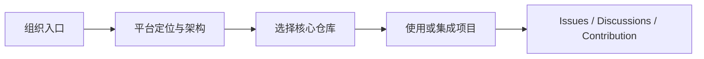



  

# g2rain

下一代AI软件开发范式，AI原生Agent平台，开源的企业级SaaS底座。

g2rain 开源组织与平台总入口，集中介绍平台愿景、整体架构、核心项目、社区治理与贡献协作方式

[官网](https://www.g2rain.com) · [Issues](https://github.com/g2rain/g2rain/issues) · [Discussions](https://github.com/g2rain/g2rain/discussions)

## 目录

- 项目简介
- 平台定位
- 业务域说明
- 功能概览
- 使用场景
- 核心流程
- 流程图
- 技术栈
- 快速开始
- 安全说明
- 与关联仓库的关系
- 模块说明
- 职责边界
- 常见问题
- 关联仓库
- 参与贡献
- 许可证
- 联系我们
- 致谢

## 项目简介

g2rain 开源组织与平台总入口，集中介绍平台愿景、整体架构、核心项目、社区治理与贡献协作方式

## 平台定位

该仓库用于组装或运行 g2rain 平台环境。

## 业务域说明

该仓库聚焦于 `组织入口、平台愿景、生态导航、社区治理与贡献协作`。

## 功能概览

| 能力 | 说明 |
| --- | --- |
| 平台愿景与定位 | 说明 g2rain 的开源目标、企业级 SaaS 定位与 AI 原生方向。 |
| 生态仓库导航 | 集中连接平台基础服务、前端应用、脚手架、组件和部署项目。 |
| 架构资料 | 通过 docs 中的架构图与说明展示平台组成和协作关系。 |
| 社区治理 | 维护贡献方式、组织治理、社区规范与讨论入口。 |

## 使用场景

| 场景 | 说明 |
| --- | --- |
| 首次了解 g2rain | 从统一入口了解平台定位、架构与核心仓库。 |
| 选择项目与能力 | 根据开发、部署或业务需求定位对应开源仓库。 |
| 参与开源贡献 | 查阅社区治理、贡献流程和讨论渠道。 |

## 核心流程

| 流程 | 关键步骤 | 代码线索 |
| --- | --- | --- |
| 平台探索路径 | 阅读平台定位 → 查看整体架构 → 选择目标仓库 → 阅读项目 README → 通过 Issues 或 Discussions 参与社区 | README.md、docs、community、governance |

## 流程图

## 技术栈

| 类别 | 说明 |
| --- | --- |
| 文档 | Markdown |
| 协作 | GitHub Issues、Discussions、Pull Requests |

## 快速开始

| 步骤 | 命令或位置 | 说明 |
| --- | --- | --- |
| 浏览平台 | `https://www.g2rain.com` | 访问官方网站了解平台。 |
| 查看项目 | `https://github.com/orgs/g2rain/repositories` | 浏览组织全部开源仓库。 |

## 安全说明

| 主题 | 说明 |
| --- | --- |
| 公开信息 | 组织入口只发布可公开的平台、治理和社区信息，不应包含内部凭据或未公开资料。 |

## 与关联仓库的关系

本仓库连接 g2rain 组织下的后端基础服务、前端应用、开发工具、业务示例与部署仓库，为使用者和贡献者提供统一导航。

## 模块说明

| 模块 | 职责说明 | 代码线索 |
| --- | --- | --- |
| docs | 维护平台架构图与说明资料。 | docs |
| community | 维护社区协作与公共规范。 | community |
| governance | 维护组织治理机制与角色说明。 | governance |

## 职责边界

该仓库主要负责：
- 负责集中表达 g2rain 平台愿景、架构、生态仓库导航与社区治理信息
- 负责提供组织级贡献、讨论、许可证与项目入口

该仓库默认不负责：
- 不承载具体业务服务、前端应用或部署脚本的运行实现
- 不替代各子仓库维护其专属使用、配置和开发文档

## 常见问题

| 问题 | 可能原因 | 处理建议 |
| --- | --- | --- |
| 项目入口失效 | 仓库名称、默认分支或文档链接发生变化。 | 更新 README 中的生态导航并以 g2rain 组织仓库列表为准。 |

## 关联仓库

| 仓库 | 协作关系 |
| --- | --- |
| g2rain-iam | 协同完成登录认证、令牌发放、SSO 回调或前端登录态衔接。 |
| g2rain-main-shell | 作为微前端主应用，负责装载子应用并提供统一平台入口。 |

## 参与贡献

我们欢迎所有形式的贡献：Issue 反馈、文档改进、功能建议与代码提交。

推荐流程：

1. Fork 本仓库。
2. 创建特性分支：`git checkout -b feature/your-feature-name`。
3. 提交更改：`git commit -m "Add some feature"`。
4. 推送分支：`git push origin feature/your-feature-name`。
5. 提交 Pull Request。

代码贡献前请尽量补充必要的测试和文档，并确保构建、测试与静态检查通过。

## 许可证

本项目基于 [Apache 2.0许可证](https://github.com/g2rain/g2rain-common/blob/main/LICENSE) 开源。

## 联系我们

- Issues: [GitHub Issues](https://github.com/g2rain/g2rain/issues)
- 讨论: [GitHub Discussions](https://github.com/g2rain/g2rain/discussions)
- 邮箱: g2rain_developer@163.com

## 致谢

感谢所有为 g2rain 项目提交 Issue、代码、文档、建议和使用反馈的开发者们！
