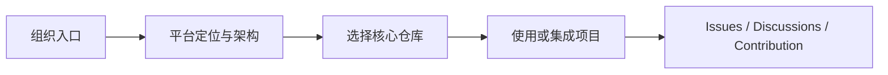

<p align="center">
  
</p>

# g2rain

[](LICENSE)
[](https://github.com/g2rain)

下一代AI软件开发范式，AI原生Agent平台，开源的企业级SaaS底座。

g2rain 开源组织与平台总入口，集中介绍平台愿景、整体架构、核心项目、社区治理与贡献协作方式

[官网](https://www.g2rain.com) · [平台文档](docs/index.md) · [组织级架构基线](docs/architecture/README.md) · [官方前端脚手架](docs/architecture/platform-tools/g2rain-app-cli.md) · [Issues](https://github.com/g2rain/g2rain/issues) · [Discussions](https://github.com/g2rain/g2rain/discussions)

## 目录

- 项目简介
- 平台定位
- 业务域说明
- 功能概览
- 使用场景
- 核心流程
- 流程图
- 技术栈
- 快速开始
- 安全说明
- 与关联仓库的关系
- 模块说明
- 职责边界
- 常见问题
- 关联仓库
- 参与贡献
- 许可证
- 联系我们
- 致谢

## 项目简介

g2rain 开源组织与平台总入口，集中介绍平台愿景、整体架构、核心项目、社区治理与贡献协作方式

## 平台定位

该仓库是 G2rain 的组织级架构与治理事实来源：维护平台术语、版本化架构 Profile、跨项目 ADR、项目目录与迁移规则。它不包含可部署应用，也不承载任何项目的运行时实现。

## 业务域说明

该仓库聚焦于 `组织入口、平台愿景、生态导航、社区治理与贡献协作`。

## 功能概览

| 能力 | 说明 |
| --- | --- |
| 平台愿景与定位 | 说明 g2rain 的开源目标、企业级 SaaS 定位与 AI 原生方向。 |
| 生态仓库导航 | 集中连接平台基础服务、前端应用、脚手架、组件和部署项目。 |
| 架构资料 | 通过 docs 中的架构图与说明展示平台组成和协作关系。 |
| 架构基线 | 维护多仓库项目的架构 Profile、跨项目 ADR、版本与迁移规则。 |
| 平台共享库 | 登记公共 JAR、Starter 和前端公共包等 Supporting Library 及其兼容契约。 |
| 项目接入目录 | 记录项目采用的 Profile、固定基线、验证状态与已登记的架构例外。 |
| 社区治理 | 维护贡献方式、组织治理、社区规范与讨论入口。 |

## 使用场景

| 场景 | 说明 |
| --- | --- |
| 首次了解 g2rain | 从统一入口了解平台定位、架构与核心仓库。 |
| 选择项目与能力 | 根据开发、部署或业务需求定位对应开源仓库。 |
| 参与开源贡献 | 查阅社区治理、贡献流程和讨论渠道。 |

## 核心流程

| 流程 | 关键步骤 | 代码线索 |
| --- | --- | --- |
| 平台探索路径 | 阅读平台定位 → 查看整体架构 → 选择目标仓库 → 阅读项目 README → 通过 Issues 或 Discussions 参与社区 | README.md、docs、community、governance |

## 流程图


```mermaid
flowchart LR
  A[组织入口] --> B[平台定位与架构]
  B --> C[选择核心仓库]
  C --> D[使用或集成项目]
  D --> E[Issues / Discussions / Contribution]
```

## 技术栈

| 类别 | 说明 |
| --- | --- |
| 文档 | Markdown |
| 协作 | GitHub Issues、Discussions、Pull Requests |

## 快速开始

| 步骤 | 命令或位置 | 说明 |
| --- | --- | --- |
| 浏览平台 | `https://www.g2rain.com` | 访问官方网站了解平台。 |
| 查阅架构基线 | [docs/architecture/README.md](docs/architecture/README.md) | 了解 Profile、平台工具、共享库、唯一服务及基线版本。 |
| 查看项目目录 | [docs/architecture/catalog/projects.yaml](docs/architecture/catalog/projects.yaml) | 按项目的接入状态与固定基线选择后续仓库。 |

## 安全说明

| 主题 | 说明 |
| --- | --- |
| 公开信息 | 组织入口只发布可公开的平台、治理和社区信息，不应包含内部凭据或未公开资料。 |
| 架构决策 | 跨项目的模块、协作、安全或发布规则必须先形成中央 ADR、经过代表项目试点并由项目显式升级；不得静默改写项目基线。 |
| 安全报告 | 未修复的安全问题不应公开披露；请遵循 [安全与漏洞披露流程](governance/security.md)。 |

## 与关联仓库的关系

本仓库连接 g2rain 组织下的后端基础服务、前端应用、开发工具、业务示例与部署仓库，为使用者和贡献者提供统一导航。

## 模块说明

| 模块 | 职责说明 | 代码线索 |
| --- | --- | --- |
| docs | 维护平台架构图与说明资料。 | docs |
| docs/architecture | 维护组织级架构 Profile、ADR、项目目录和迁移规则。 | docs/architecture |
| docs/architecture/platform-tools | 登记唯一或共享平台工具的定位、跨仓库契约和版本关系。 | docs/architecture/platform-tools |
| docs/architecture/platform-libraries | 登记平台 Supporting Library 的公共 API、依赖方向、发布与消费契约。 | docs/architecture/platform-libraries |
| community | 维护社区协作与公共规范。 | community |
| governance | 维护组织治理机制与角色说明。 | governance |

## 职责边界

该仓库主要负责：
- 负责集中表达 g2rain 平台愿景、架构、生态仓库导航与社区治理信息
- 负责提供组织级贡献、讨论、许可证与项目入口
- 负责维护同类项目共享的版本化架构基线和跨项目架构决策

该仓库默认不负责：
- 不承载具体业务服务、前端应用或部署脚本的运行实现
- 不替代各子仓库维护其专属使用、配置和开发文档
- 不在中央文档中覆盖项目 Requirements、领域 Design 和项目级架构例外

## 多仓库架构治理

g2rain 使用“组织级 Profile + 项目基线声明 + 显式例外”的方式维护 20 多个仓库的一致性：

```text
中央架构 Profile
→ 项目声明采用的版本
→ 项目领域文档与例外
→ Agent 根据源码和 Git Diff 动态审核
```

当前包含三个正式组织级 Profile：[Java 领域服务](docs/architecture/profiles/java-domain-service/README.md) `1.0.0` 已由 `g2rain-member` 采用，`g2rain-department`、`g2rain-basis` 与 `g2rain-infra` 正在按项目差异计划接入；[前端 App](docs/architecture/profiles/frontend-app/README.md) `1.0.0` 已完成模板和真实业务 App 的首轮验证；[前端 Shell](docs/architecture/profiles/frontend-shell/README.md) `1.0.0` 已由唯一主应用 `g2rain-main-shell` 验证并采用。另有[Gateway Service](docs/architecture/profiles/gateway-service/README.md) `1.0.0-draft`，由 `g2rain-gateway-webflux` 试点，后续覆盖 WebMVC Gateway。`g2rain-app-cli` 提供符合前端 App Profile 的项目创建入口。

组织级唯一实现分别按职责登记：`g2rain-app-cli` 是研发期平台工具；[`g2rain-iam`](docs/architecture/platform-services/g2rain-iam.md) 是持续运行的平台唯一安全服务，维护认证、授权、Token、IdP 及跨仓库安全契约。

[`g2rain-appkit`](docs/architecture/platform-libraries/g2rain-appkit.md) 与 `g2rain-common`、`g2rain-spring-boot-starter` 具有相同的平台角色，均为被其他项目按版本依赖的 Supporting Library。`g2rain-appkit` 统一发布主题、UI、HTTP 与运行时公共能力，不作为浏览器 App 采用 `frontend-app` Profile。

[`g2rain-crafter`](docs/architecture/platform-tools/g2rain-crafter.md) 是官方后端项目与代码生成 Maven 插件，通过统一 `bootstrap` Goal 创建 API/Biz/Startup 骨架并复用底层 Generator 生成业务代码。

[`g2rain-generator-maven-plugin`](docs/architecture/platform-tools/g2rain-generator-maven-plugin.md) 是 Crafter foundry 阶段使用的官方后端数据库代码生成引擎，也可通过独立 `generate` Goal 使用。

最新的 [ADR-0008：通用联邦转发与本地环境授权绑定](docs/architecture/decisions/0008-federation-forwarder.md) 处于“建议”状态，登记的 `g2rain-federation-forwarder` 与 `g2rain-federation-auth-app` 均为计划组件，尚未实现或联调。它们不能被当作当前可用的平台服务。

[知识服务跨仓库集成设计与闭环评估](docs/architecture/knowledge-service-integration-design.md) 同样是设计评估稿：知识服务的业务设计、代码和运行验证仍归 `g2rain-knowledge` 仓库所有，中央文档不代表服务已完成交付。

## 常见问题

| 问题 | 可能原因 | 处理建议 |
| --- | --- | --- |
| 项目入口失效 | 仓库名称、默认分支或文档链接发生变化。 | 更新 README 中的生态导航并以 g2rain 组织仓库列表为准。 |

## 关联仓库

| 仓库 | 协作关系 |
| --- | --- |
| g2rain-iam | 协同完成登录认证、令牌发放、SSO 回调或前端登录态衔接。 |
| g2rain-main-shell | 作为微前端主应用，负责装载子应用并提供统一平台入口。 |
| [g2rain-app-cli](https://github.com/g2rain/g2rain-app-cli) | 唯一官方前端项目脚手架，从标准模板生成采用中央 `frontend-app` Profile 的业务 App。 |
| [g2rain-app-template](https://github.com/g2rain/g2rain-app-template) | 为官方 CLI 提供前端目录、运行时、资源生成、构建部署和项目文档基线。 |
| [g2rain-appkit](https://github.com/g2rain/g2rain-appkit) | 与 g2rain-common、Starter 同类的 Supporting Library，提供版本化前端公共包。 |

## 参与贡献

我们欢迎所有形式的贡献：Issue 反馈、文档改进、功能建议与代码提交。

推荐流程：

1. Fork 本仓库。
2. 创建特性分支：`git checkout -b feature/your-feature-name`。
3. 提交更改：`git commit -m "Add some feature"`。
4. 推送分支：`git push origin feature/your-feature-name`。
5. 提交 Pull Request。

代码贡献前请尽量补充必要的测试和文档，并确保构建、测试与静态检查通过。

## 许可证

本项目基于 [Apache 2.0 许可证](LICENSE) 开源。

## 联系我们

- Issues: [GitHub Issues](https://github.com/g2rain/g2rain/issues)
- 讨论: [GitHub Discussions](https://github.com/g2rain/g2rain/discussions)
- 邮箱: g2rain_developer@163.com

## 致谢

感谢所有为 g2rain 项目提交 Issue、代码、文档、建议和使用反馈的开发者们！
