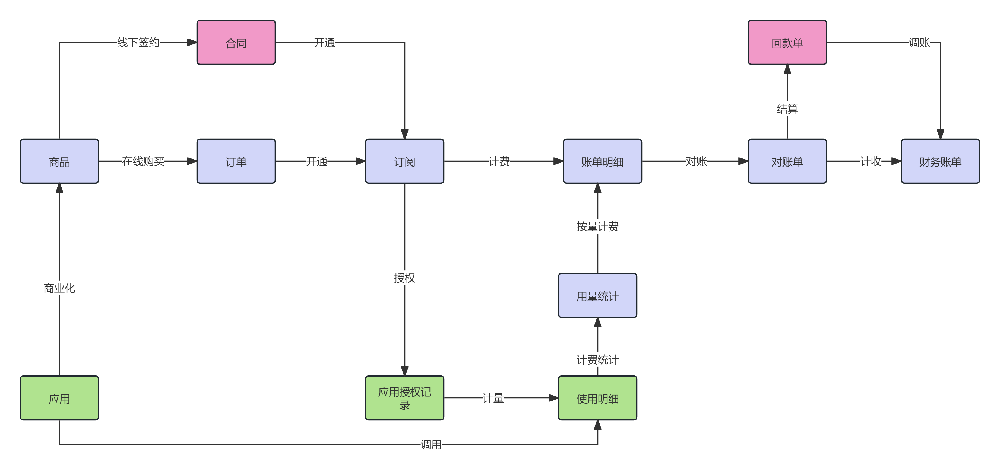
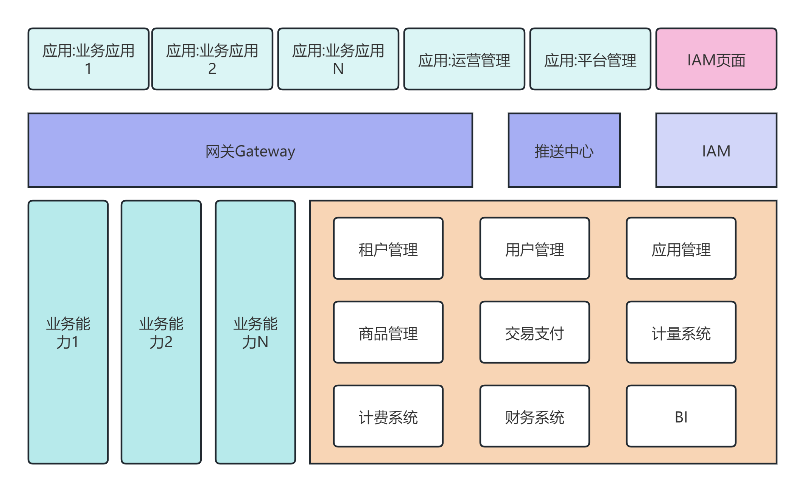
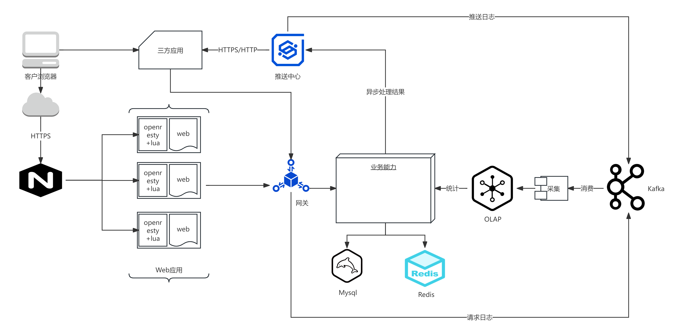

# G2Rain 架构

## 高层概述

G2Rain 的架构旨在提供可扩展性、模块化和灵活性，确保从应用开发到账单生成和财务结算的高效协同。系统分为三个主要层次：**应用层**、**业务能力层** 和 **基础服务层**。

### 架构组件

1. **网关**：作为应用和后端服务之间的通信枢纽，负责请求路由、身份验证和日志采集。
   
2. **推送中心**：处理后台异步任务和通知，确保业务流程的实时性和连续性。

3. **IAM 服务（身份与访问管理）**：管理多应用场景下的用户身份和访问权限，支持单点登录（SSO）和角色管理。

4. **应用层**：独立的微服务应用，每个应用包含独立的功能模块。应用之间完全隔离，支持快速响应客户需求和场景变化。

5. **订阅系统**：管理产品订阅的生命周期，包括激活、过期和功能访问控制。

6. **账单系统**：根据订阅数据和计量结果生成账单，支持多种计费模式，包括按需计费和订阅计费。

7. **BI 系统**：提供业务数据分析，帮助管理层做出实时决策，涵盖收入、客户、运营等核心指标。

---

## 系统流

G2Rain 平台遵循一个清晰的**应用到收入**的流动过程，主要包括以下步骤：

1. **应用开发**：基于市场和客户反馈，产研团队开发独立的应用项目，快速响应市场需求。
2. **商业化配置**：定义每个应用的定价和功能，支持不同客户的需求。
3. **交易与订阅**：客户购买并激活产品，系统生成订阅记录，链接产品与租户信息。
4. **授权与资源分配**：根据订阅记录，分配相应的功能权限。
5. **账单生成**：根据计费方式和用量数据生成账单。
6. **对账与结算**：系统生成对账单，与客户核对并收款，完成结算流程。

---

## 系统架构图

- **应用**：为平台客户提供具体的功能。
- **网关**：作为应用与后端服务的连接点，确保安全通信和数据流动。
- **推送中心**：实时处理异步任务并推送结果到应用。
- **IAM**：管理身份验证和访问控制，保障数据安全。
- **后台服务**：提供数据存储、处理和微服务能力，支撑核心业务。
  
---

## 系统部署结构

G2Rain 的部署架构考虑了**高可用、易扩展、可监控**的目标，通过分层部署和异步通信来保障系统的稳定运行，降低运维成本。

1. **客户端代理**：客户代理(常指浏览器)通过 HTTPS 协议与 Nginx 进行交互，确保数据传输的安全性。
2. **应用层**：包括各个独立部署的应用，支持不同的业务场景，如财务、电商、营销等。
3. **业务支撑层**：提供公共的业务能力和核心业务能力（如支付、账单管理、计量等），其中计量服务通过Kafka接收网关和推送中心的日志，完成处理后存储到分析性数据库中。
4. **后台服务层**：基于 MySQL 和 Redis 的存储架构，提供持久化数据存储和高速缓存功能。
