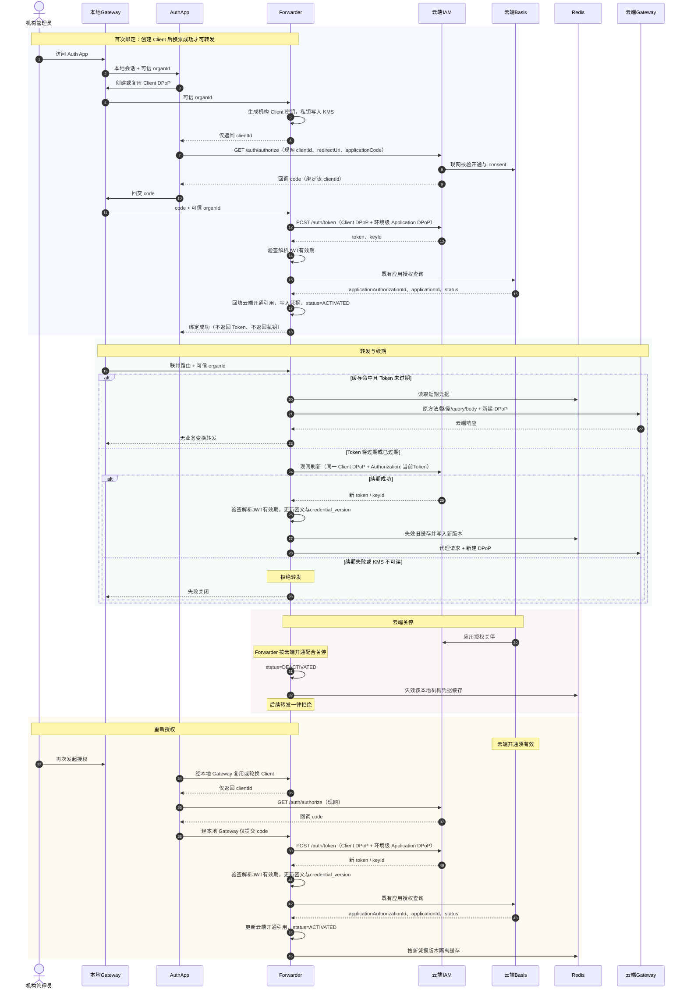

# ADR-0008：通用联邦转发与本地环境授权绑定

## 状态

建议（待 `g2rain-federation-forwarder`、`g2rain-federation-auth-app`、云端 IAM/Basis 与本地 Gateway 联合试点）

## 背景

私有部署的 G2Rain 在本地运行多租户业务、应用与 Gateway，并需要按机构调用联邦端（云端）托管的能力，例如 Agent Runtime。业务 App 或领域服务不应直接持有联邦协议、地址或凭据；本地 Gateway 也不应承担 OAuth 回调页面和长期凭据持久化。

现有平台中，本地 Gateway 已从本地 Basis 动态装载路由并完成 JWT、DPoP、API 权限与可信主体重建。云端 `application` 与 `application_authorization` 表达联邦应用及云端机构开通事实；云端要求如何授权，本地 Forwarder 只配合，不另造授权模型。本设计保留这些边界，新增通用的联邦转发和认证能力。

## 决策

新增两个独立部署的通用组件。Forwarder 相关的授权码、换票、续期和开通事实一律对 **云端 IAM / 云端 Basis**，走 IAM **现网**契约；不在本地 IAM 上做联邦扩展或上游换票。

| 组件 | 职责 | 不承担 |
| --- | --- | --- |
| `g2rain-federation-forwarder` | 读取 Nacos 联邦目标配置；按本地 Gateway 重建的 `organId` 解析绑定；**生成并持有机构级 Client DPoP**；持有**本环境唯一一份 Application DPoP**；以两者完成授权码换票，以 Client DPoP 和原 Token 完成续期；受控代理请求并按最终 URL 新建 Client DPoP | 认证页面、发明云端授权规则、Agent 或任何领域编排 |
| `g2rain-federation-auth-app` | 提供管理员授权页面；经本地 Gateway 调 Forwarder 取得 `clientId`；浏览器跳转云端 IAM 现网 `/auth/authorize` 拿一次性授权码并经本地 Gateway 回交 Forwarder；展示绑定状态和结果 | 生成密钥对、持有私钥、调用 `/auth/token`、代理业务请求、保存/解密凭据、替代本地 Gateway 的用户登录 |

```text
本地 App / 调用方
        │ 原 URL、调用方式不变
        ▼
本地 Gateway ──本地路由──► 本地领域服务
        │
        └──联邦路由──► g2rain-federation-forwarder
                                │ 云端 Token + 新建 DPoP
                                ▼
                           云端 Gateway → 云端应用

机构管理员 ──本地 Gateway──► Auth App ──本地 Gateway──► Forwarder 创建/复用 Client
                    │ 仅返回 clientId（无私钥）；organId 来自本地 Gateway
                    ▼
              云端 IAM /auth/authorize?clientId=...（现网）
                    ↑ 回调 code（已绑定该 clientId）
                    └──经本地 Gateway 把 code 交给 Forwarder
                                │ Client DPoP + 环境级 Application DPoP
                                ▼
                         云端 IAM /auth/token 换票并保存授权结果
```

Client DPoP 只在 Forwarder 侧按机构生成。云端 IAM 现网 `/auth/authorize` 首次进入必填 `clientId`，发码绑定该值；因此 **必须先经本地 Gateway 调 Forwarder 创建 Client，再进云端授权码流程**。Auth App 不是持钥客户端：它不创建密钥对、不保存 JWK/私钥、不调用 `/auth/token`，只把 Forwarder 返回的 `clientId` 传给云端 `/auth/authorize`。`redirect_uri` 仍登记为 Auth App 的浏览器回调。换票完整走现网：Client DPoP 的 `kid` 等于发码 `clientId`，Application DPoP 的 `acd` 等于 Nacos 中的 `applicationCode`。

创建 Client 与回交 `code` 都经本地 Gateway，**一定能拿到本地 `organId`**，不信任页面提交。Forwarder 只允许本地 Gateway 网络调用；认证 App 经本地 Nginx/Gateway 仅向机构管理员暴露。普通业务 App 始终只调用本地 Gateway。

Application DPoP 是**应用级、本 Forwarder 部署只存在一份**，存 Secret/KMS，不写入机构授权表，不按机构复制。Client DPoP 按本地机构多份并存。

## 配置与数据边界

### Nacos：联邦目标的非敏感配置

当前仅支持一个联邦端。云端应用代码、云端 Gateway 地址和连接协议由 Nacos 配置，按环境/命名空间隔离。Nacos 是可动态刷新的目标配置源，不是凭据仓库；它不配置 API Scope、路径前缀或云端服务路由规则。授权与换票使用云端 IAM **现网路径**（经云端 Gateway）：`GET /auth/authorize`、`POST /auth/token`，不另配第三方 `authorization-url` / `token-url`，也不把未上线的 PKCE/回调白名单当成联邦前置。

```yaml
g2rain:
  federation:
    application-code: federation-runtime
    gateway-base-url: https://federation-gateway.example.com
    callback-path: /federation/auth/callback
    connect-timeout-ms: 3000
    read-timeout-ms: 30000
```

Auth App 先向 Forwarder 取得 `clientId`，再浏览器跳转云端 `gateway-base-url` 的 `/auth/authorize`（现网必带 `clientId`、`redirectUri`，可选 `applicationCode`）；`POST /auth/token` 只允许持钥的 Forwarder 调用云端。

首期认证模式固定为云端 IAM 现网授权码 + Client DPoP + Application DPoP，不作为 Nacos 可选项。配置变更必须校验 `application-code` 唯一、HTTPS Gateway 地址、超时上限及回调路径。不得在 Nacos 放置 Client Secret、Access Token、Application DPoP 私钥或 Client DPoP 私钥。

### 数据归属

| 数据 | 存放位置 |
| --- | --- |
| 唯一联邦应用代码、云端 Gateway 地址、连接协议和回调路径 | 本地 Nacos |
| 本地 API 路径、方法、目标服务与接口权限 | 本地 Basis `service_registry` / `resource_api` |
| 云端 API 路径、方法、目标服务与接口权限 | 云端 Basis 接口注册 |
| 云端应用与机构开通 `application` / `application_authorization` | **云端 Basis**；Forwarder 不持有开通主数据，按云端规则配合 |
| 本地机构绑定、凭据元数据、加密 Token、Client DPoP | Forwarder 私有数据库（`organ_id` 为本地机构） |
| Application DPoP（应用级，环境一份） | Forwarder 本环境 Secret/KMS；不入库、不按机构复制 |
| Client DPoP 私钥 | Forwarder 生成后写入 Secret/KMS；表中仅存引用。云端 IAM 只校验证明 |
| 短期 Access Token 缓存 | 受控 Redis，按本地机构与凭据版本隔离 |
| 审计 | 既有 `audit_event`，不记录 Token、密码、私钥、授权码或请求正文 |

本地 Basis 无联邦凭据表。运行时“本地环境 + 本地机构 + 云端目标”的绑定与缓存由 Forwarder 自己持有。

## 数据模型

新增表是 `g2rain-federation-forwarder` 的私有数据，不属于本地或云端 Basis 初始化脚本。`organ_id` 是本地 Gateway 重建的本地机构；`application_id` / `application_authorization_id` 引用 **云端** 开通事实，在云端换票或查询成功后回填，创建 Client 时可以为空。控制域、订阅只存在于云端开通记录，Forwarder 不复制。当前只有一个联邦端，环境身份由部署/Nacos 表达。所有 ID 使用平台 ID 生成器。

### 1. `federation_organ_authorization`

一个本地机构对唯一云端联邦应用的绑定与凭据。表状态只使用 `ACTIVATED` / `DEACTIVATED`，语义跟随云端应用授权；不另设 `PENDING`、`SUSPENDED`、`EXPIRED` 或 `REVOKED`。创建 Client 时尚无 Token，**不得按可转发处理**；仅当云端开通有效且换票成功后才视为可转发。

```sql
CREATE TABLE `federation_organ_authorization` (
    `id` BIGINT NOT NULL COMMENT '主键标识',
    `application_authorization_id` BIGINT DEFAULT NULL COMMENT '云端应用授权记录标识，经云端既有授权查询回填',
    `organ_id` BIGINT NOT NULL COMMENT '本地机构标识，来自本地 Gateway 可信主体',
    `application_id` BIGINT DEFAULT NULL COMMENT '云端应用标识，经云端既有授权查询回填',
    `client_id` VARCHAR(128) DEFAULT NULL COMMENT 'DPoP客户端标识，对齐AppKit DpopClient.clientId',
    `client_public_key` TEXT DEFAULT NULL COMMENT 'DPoP客户端公钥JWK，对齐AppKit DpopClient.publicKey',
    `client_private_key_ref` VARCHAR(256) DEFAULT NULL COMMENT 'DPoP客户端私钥Secret/KMS引用，对齐AppKit DpopClient.privateKey但不存私钥',
    `token_ciphertext` MEDIUMTEXT DEFAULT NULL COMMENT 'KMS信封加密的Token，对应IAM TokenVo.token',
    `key_id` VARCHAR(128) DEFAULT NULL COMMENT 'Token签发密钥标识，对应IAM TokenVo.keyId',
    `encryption_key_id` VARCHAR(128) DEFAULT NULL COMMENT 'Token密文使用的KMS Key ID',
    `credential_version` VARCHAR(64) NOT NULL COMMENT '凭据版本；轮换后缓存以此隔离',
    `expire_at` TIMESTAMP NULL DEFAULT NULL COMMENT '从JWT expireAt Claim解析的Token过期时间',
    `refresh_expire_at` TIMESTAMP NULL DEFAULT NULL COMMENT '从JWT refreshExpireAt Claim解析的续期截止时间',
    `status` VARCHAR(32) NOT NULL DEFAULT 'DEACTIVATED' COMMENT '跟随云端应用授权[ACTIVATED:激活,DEACTIVATED:关停]；无有效Token时不得转发',
    `description` VARCHAR(512) DEFAULT NULL COMMENT '说明',
    `create_time` TIMESTAMP NULL DEFAULT CURRENT_TIMESTAMP COMMENT '创建时间',
    `update_time` TIMESTAMP NULL DEFAULT CURRENT_TIMESTAMP ON UPDATE CURRENT_TIMESTAMP COMMENT '更新时间',
    `version` INT NOT NULL DEFAULT 0 COMMENT '乐观锁版本',
    `delete_flag` TINYINT NOT NULL DEFAULT 0 COMMENT '删除标识[0:未删除,1:已删除]',
    PRIMARY KEY (`id`),
    UNIQUE KEY `uk_active_local_organ` (
        `organ_id`,
        (IF(`delete_flag` = 0, 0, NULL))
    ),
    INDEX `idx_organ_application_status` (`organ_id`, `application_id`, `status`),
    INDEX `idx_cloud_application_authorization` (`application_authorization_id`)
) ENGINE=InnoDB DEFAULT CHARSET=utf8mb4 COLLATE=utf8mb4_0900_ai_ci
  COMMENT='本地机构的联邦授权与凭据';
```

字段不是重新定义 IAM 或 AppKit 的 DTO。以下映射是实现和接口评审的强制约束。

| 表字段 | 既有契约字段/语义 | 规则 |
| --- | --- | --- |
| `organ_id` | 本地 Gateway 可信主体 `organId` | 创建 Client / 交码 / 转发均只信本地 Gateway，不信页面或云端回调里的裸机构头。 |
| `application_authorization_id`、`application_id`、`status` | 云端 `ApplicationAuthorizationVo.id`、`applicationId`、`status` | 开通主数据在云端；授权码换票成功后，Forwarder 调用云端 Basis 既有授权查询接口回填。失败回调不伪造开通 id。 |
| `client_id`、`client_public_key`、`client_private_key_ref` | AppKit `DpopClient.clientId`、`publicKey`、`privateKey` | **机构级 Client DPoP**，Forwarder 在进入云端 `/auth/authorize` 之前生成或复用。Auth App 只接收 `clientId`。私钥不能落库明文。 |
| `token_ciphertext`、`key_id` | 云端 IAM `TokenVo.token`、`keyId` | 解密后的服务对象使用 IAM 原字段名。 |
| `expire_at`、`refresh_expire_at` | JWT `expireAt`、`refreshExpireAt` Claim | 仅为解密并验签 Token 后得到的本地索引，不是 `TokenVo` 返回字段；续期以当前 `token_ciphertext` 解密后的 Token 放入 `Authorization` 完成。 |
| `credential_version`、`encryption_key_id` | 联邦持久化控制元数据 | 不伪装成 IAM/AppKit 业务字段。 |

Application DPoP **不是表字段**：本环境唯一一份，由 Forwarder 从 KMS 读取，**只用于授权码换票**。云端 IAM 换票响应只有 `token`、`keyId`；`expireAt`、`refreshExpireAt` 由 Forwarder 验签并解析 JWT Claim 获得，不下发独立刷新 Token 或任何 DPoP 私钥。续期与业务转发均使用机构 Client DPoP。

### 临时授权事务归云端 IAM 现网

浏览器授权的 `state`、流程 Cookie、一次性授权码、回调超时与重放保护复用 **云端 IAM 现网** Redis 授权事务。不在云端事务中冻结本地 `organId`，也不把未上线的 `applicationAuthorizationId` / PKCE / 回调白名单当成联邦前置。云端按现网处理登录、选用户/机构、consent 与发码。

顺序强制为：

1. 管理员经本地 Gateway 访问 Auth App。Auth App 经本地 Gateway 调 Forwarder 创建或复用本机构 Client DPoP。`organId` 来自本地 Gateway。首次生成密钥对、私钥写入 KMS。此时尚无有效 Token，不得转发。
2. Auth App 携带该 `clientId`、已登记 `redirectUri` 跳转云端 IAM `/auth/authorize`（现网；无 `clientId` 则云端失败）。发码绑定同一 `clientId`。
3. 云端将一次性授权码回调至 Auth App。Auth App 经本地 Gateway 把 `code` 交给 Forwarder，随后丢弃 `code`。交码请求同样带本地 Gateway 重建的 `organId`。
4. Forwarder 调用云端 `/auth/token`，完整现网：该机构 Client DPoP（`kid` = `clientId`）+ 本环境唯一 Application DPoP（`acd` = `applicationCode`）。成功后写入加密 Token，验签解析 JWT 的有效期 Claim；再调用云端 Basis 的既有应用授权查询接口，回填云端 `application_authorization_id` / `application_id`，并按查询结果将 `status` 置为 `ACTIVATED`。

认证 App 不创建第二份 OAuth 事务，不生成密钥，不保存 Token。云端开通如何确认、如何发码，Forwarder 只配合，不在本地重做一套授权规则。

因此只有 Forwarder 新增这一张私有表。有效唯一键按本地 `organ_id` 使用平台函数索引规则，允许逻辑删除后重新创建。生产迁移由 Forwarder 自己维护。

## 主要业务逻辑

### A. 管理员开通与页面授权

1. 运维在 Nacos 配置唯一云端联邦目标；校验格式、HTTPS、超时与回调路径。
2. 云端维护联邦应用与 `application_authorization`。本地不复制开通主数据；云端要求如何授权，Forwarder 配合。
3. 本地机构管理员经本地 Gateway 登录 Auth App。创建 Client、交码均走本地 Gateway，**一定能获得本地 `organId`**，不信任页面提交。
4. Auth App **先**经本地 Gateway 调 Forwarder 创建或复用 Client DPoP，只拿到 `clientId`。缺少这一步不得跳转云端 IAM。
5. Auth App 再跳转云端 IAM 现网 `/auth/authorize`，携带 `clientId`、`redirectUri`、Nacos `applicationCode`。云端按现网创建事务、登录、consent 与发码。此步不出现任何 DPoP 私钥。
6. 云端回调 `code`（已绑定该 `clientId`）。Auth App **只**经本地 Gateway 把 `code` 交给 Forwarder。Forwarder 用同一 Client DPoP + 环境级 Application DPoP 调云端 `/auth/token`，再经云端 Basis 既有授权查询回填开通引用与状态。
7. 云端回调失败、state 复用、过期时由云端 IAM 终结事务。无有效 Token 不得转发；已有可转发凭据时，失败路径不得覆盖。主动重新授权且云端换票成功时，用新凭据与 `credential_version` 替换。Client 已生成但换票失败时，不得留下可转发状态。

### B. 本地路由与转发

1. 本地 Basis 用 `service_registry` / `resource_api` 把联邦接口路由到 `lb://g2rain-federation-forwarder`。本地注册决定谁进 Forwarder，云端注册决定落到哪个云端服务。二者均不由客户端 Header 决定。
2. 本地 Gateway 完成既有本地 JWT、DPoP、请求摘要、API 权限和可信主体重建。业务 App、领域服务和原有调用地址均不改动。
3. Forwarder 只接受本地 Gateway 受控请求，以重建的本地 `organId` 查询本表绑定，并校验云端开通状态（已回填）、Token 有效期与凭据版本。无 Token 或非 `ACTIVATED` 则拒绝。
4. 授权码换票时，Forwarder 使用该机构 Client DPoP 与**环境唯一** Application DPoP。Token 续期时，Forwarder 仅使用同一机构 Client DPoP，并将当前 Token 放入 `Authorization` 调用云端 IAM；按最终云端 URL、方法、query 与正文创建新的**机构 Client DPoP**代理业务请求。原调用方 DPoP 不转发。不支持 AK/SK 或静态 Token。Client 密钥轮换按机构在 Forwarder 生成新 Client；Application DPoP 轮换是环境级一次，后续授权码换票改用新的这一份应用钥。
5. Forwarder 不解释 Scope、路径前缀、服务名或业务载荷：将本地 Gateway 已裁剪的方法、路径、query、body 和响应无业务变换地代理至云端 Gateway。云端 Gateway 按现网校验 Token、DPoP 与开通；云端业务仍执行自己的租户、对象和数据级授权。

### C. 生命周期、轮换与撤销

```text
DEACTIVATED --云端开通有效且换票成功--> ACTIVATED（可转发）
ACTIVATED --云端应用授权关停--> DEACTIVATED
Token 过期 --云端现网刷新成功--> ACTIVATED（更新 expireAt 与凭据版本）
Token 过期 --刷新失败--> 保持 ACTIVATED 但拒绝转发，直至重新授权或云端关停
创建 Client 后、换票前 --> 有 Client、无 Token，不得转发
```

`ACTIVATED` 跟随云端开通且表示本地已写入过有效绑定，不等于当前一定能转发。重新转发必须云端开通仍有效，并再走完整授权码绑定（若凭据已失效）。



- Forwarder 只通过云端 IAM 现网刷新，不直连其它换票协议；新凭据版本使旧 Redis 失效。
- 云端撤销/关停、KMS 无法读取或 DPoP 轮换失败时失败关闭。云端开通关停后本表配合为 `DEACTIVATED`。
- Forwarder 缓存不是开通主数据；开通以云端为准。
- 创建 Client、授权发起、回调结果、续期、关停、撤销和转发结果写入 `audit_event`，仅记录关联 ID、状态、耗时、错误码与 trace ID。

## 安全与可靠性要求

- Nacos 仅配置非敏感联邦目标；凭据不写入 Nacos、普通数据库字段、日志、同步消息、错误响应或测试夹具。
- `token_ciphertext` 仅允许 KMS 信封加密。Client 私钥引用与 **唯一一份 Application DPoP 私钥** 仅允许 Secret/KMS；读取权限仅限 Forwarder。Auth App 只可接收 `clientId`，不得接收任何公钥或私钥。
- 授权码走云端 IAM 现网；禁止 Auth App 调用 `/auth/token`、使用隐式流或将授权码记入日志。
- 已知风险（本期记录，不处理）：云端 IAM 现网 `/auth/authorize` 目前仅校验 `redirectUri` 非空，尚未对已登记回调地址做精确匹配；本 ADR 不把该能力表述为现网保障，也不在本期新增替代校验。
- 本地 `organId` 只信本地 Gateway 重建主体；云端不得信任本地传入的裸 `X-ORGAN-ID`。
- 写请求默认不重试；只对显式幂等的联邦 API 重试。连接、读取、总体时限、限流和熔断必须配置上限。
- 首期只承诺 HTTP/JSON；文件上传、SSE、WebSocket 与大请求体需要单独验证。

## 发布顺序与验收

1. 以云端 IAM **现网**授权码/换票（含 Client DPoP + Application DPoP）为前置，不阻塞在本地 IAM 联邦扩展。再发布 Nacos 目标配置、Forwarder 私有模型、认证 App；在此之前不暴露业务联邦路由。
2. 非生产演练：经本地 Gateway 创建 Client、云端授权回调、换票、续期、应用钥/机构 Client 轮换、云端关停和重新授权。
3. 验证本地 Gateway → Forwarder 受控网络，以及云端 Token/DPoP 现网契约。
4. 最后发布本地 `service_registry` / `resource_api`，小范围机构灰度。

验收至少覆盖：

- 本地 App、领域微服务和调用 URL 无需修改；全部联邦调用经本地 Gateway 与 Forwarder。
- Client DPoP 由 Forwarder 在发码前按机构生成；Application DPoP 环境一份；Auth App 经本地 Gateway 先取 `clientId` 再跳云端 `/auth/authorize`，只回交 `code`。
- 授权码换票使用 Client DPoP + Application DPoP，`kid`/`acd` 校验通过；续期使用同一 Client DPoP + 当前 Token 的 `Authorization`，不发送 Application DPoP。
- 多个本地机构只能使用各自 Client 与凭据；交叉机构、无绑定、失效 state、回调重放、过期/撤销凭据均拒绝。
- 云端应用地址来自 Nacos；接口路径来自两端接口注册；Secret、Token 和两类 DPoP 私钥不出现在 Nacos 或普通日志。
- 授权、续期、轮换、关停、撤销、401/403、网络超时和未知写入结果具备测试和审计证据。
- 先在 WebFlux Gateway 试点；WebMVC 必须独立完成相同验证后才接入。

## 影响

- 新增 `g2rain-federation-forwarder` 与 `g2rain-federation-auth-app` 两个部署服务，后续应登记至平台服务目录、部署编排和项目目录。
- 本地 `g2rain-basis` 仍只拥有本地路由与本地开通事实；**云端** Basis 拥有联邦应用与 `application_authorization`。本地 IAM 不承担联邦发码/换票。云端 IAM 在授权码换票时校验 Client DPoP 和 Application DPoP，在续期时校验 Client DPoP 与当前 Token。Forwarder 持有机构 Client DPoP、环境级 Application DPoP、加密 Token 与绑定表。
- 本地 Gateway 的安全边界不变：它重建本地可信主体（含 `organId`），联邦凭据与云端回调逻辑不进入本地 Gateway。
