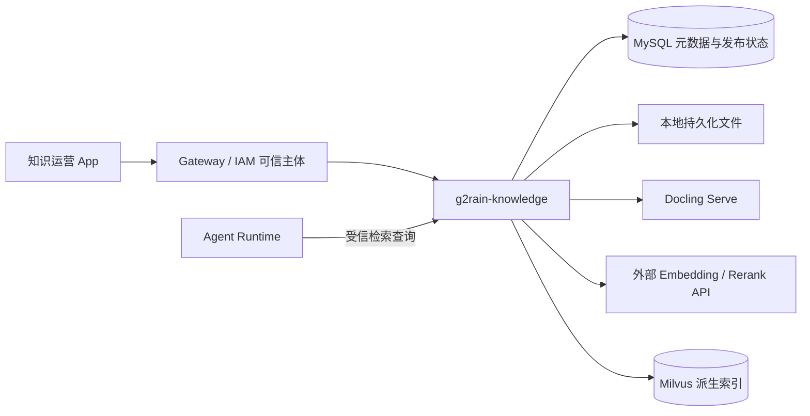

# 知识服务跨仓库集成设计与闭环评估

状态：设计评估稿；截至 2026-10-04，未完成服务实现与端到端联调。

## 目的与事实来源

本文评估 `g2rain-knowledge` 的方案是否足以支撑客服 Agent 知识闭环，并约定与 G2rain 其他仓库的协作边界。知识领域的表结构、状态机、Milvus Entity Schema、具体接口字段和项目需求继续由 `g2rain-knowledge` 维护；本文只记录跨仓库关系、当前闭环程度和联调验收条件。

评估依据为工作区中 `g2rain-knowledge` 的 `docs/project.yaml`、`docs/architecture/business-flows.md`、`domain-rules.md`、`runtime-flows.md`、`mysql-schema.md`、`milvus-design.md`、`docs/api/integration-contracts.md`、`scripts/migration/V1__create_knowledge_schema.sql`，以及 `g2rain-deploy` 的 Compose 与项目文档。项目仓库目前只有文档和 DDL；下述流程均属于目标设计。

## 平台位置与责任

| 仓库或组件 | 负责 | 集成边界 |
| --- | --- | --- |
| `g2rain-knowledge` | 文件/FAQ、版本、标签、处理任务、发布、检索证据、反馈 | 唯一知识业务入口；MySQL 裁决活动版本；本地文件与 Milvus 均由该服务编排 |
| Agent Runtime | 提问、对话编排、基于证据生成回答、人工接管决策 | 只调用有业务语义的检索契约；不读 MySQL、文件或 Milvus，不决定活动 revision |
| 运营 App | 草稿、标签、审核、发布、反馈处理的交互 | 经 Gateway 调用知识服务写用例；不能把生成的宽泛 CRUD 当作跨模块 API |
| Gateway / IAM | 入口认证、可信主体与平台权限基础 | Knowledge Service 仍校验 `organ_id`、能力点和数据归属；不能以内部网络替代服务鉴权 |
| `g2rain-deploy` | Docling Serve、Milvus、MySQL 与网络/持久化部署 | 当前 Compose 已声明 Docling、Milvus；Knowledge Service 的可执行部署尚未完成 |
| `g2rain-common` / `g2rain-generator-maven-plugin` | 公共模型、主体上下文、ID、代码生成契约 | 生成表级 CRUD；知识状态机、发布事务、索引与检索由 Biz 层实现 |

`g2rain-knowledge` 目标采用 [`java-domain-service 1.0.0`](profiles/java-domain-service/README.md)：`startup → biz → api`。API 发布可复用查询和明确的受信业务契约；Biz 拥有事务、幂等和状态迁移；Startup 负责运行时装配。跨模块同步写入如超出运营 App 经 Gateway 或领域消息路径，应按 Profile 登记例外。

## 目标闭环

| 阶段 | 输入与行为 | 可观察结果与失败出口 |
| --- | --- | --- |
| 录入 | 运营人员创建知识主题，上传文件或编辑 FAQ，选择组织内标签 | 创建草稿 revision 与受控文件；重复文件只提示，不自动替代已发布版本 |
| 解析 | Docling 解析、HybridChunker 切片，形成 chunk 清单 | 解析失败可回到草稿；**审核前不写 Embedding/Milvus** |
| 审核 | 运营在 `REVIEWING` 校验内容、标签与来源；通过后进入 `INDEXING` | 拒绝必须留原因；通过后才创建 `INDEX`，由该任务调用 Embedding |
| 索引与发布 | `INDEX` 任务完成 Embedding、Milvus 暂存（`searchable=false`）与对账；运营人员再执行人工同步发布 | 发布命令先预启用目标 Entity，再以 release 版本 CAS 切换 MySQL 活动 revision，最后关闭旧 Entity；不创建发布任务 |
| 检索与回答 | Agent Runtime 请求证据；Milvus 按组织、已发布投影和可选标签召回；MySQL 复核活动版本；Rerank 排序 | 返回可引用证据或不可回答结果；Agent Runtime 基于结果回答、澄清或人工接管 |
| 反馈与修订 | 记录低质量、错误答案、接管和人工修正 | 反馈进入运营队列；新草稿重新走审核发布，历史版本可追溯 |
| 回滚与恢复 | 选择已验证历史版本、下线或重建索引 | 发布选择与审计在 MySQL；文件和 Milvus 派生数据按活动版本校验恢复 |

标签用于业务分类和召回筛选，不用于组织隔离或权限。检索至少强制 `organ_id`；Milvus 的 `searchable` 只是派生投影，最终证据必须由 MySQL 校验 `knowledge_chunk` 与 `knowledge_release.active_revision_id`。人工发布中的补偿或旧 Entity 关闭失败不能使非活动版本成为合法证据，并可通过同步索引对账命令收敛。

## 闭环评估

结论：**概念与数据所有权已闭合；可执行的业务和运行闭环尚未完成。** 下表中的“已定义”表示有项目文档或 DDL，不表示代码已实现、容器已运行或接口已联调。

| 环节 | 当前状态 | 证据或缺口 |
| --- | --- | --- |
| 知识身份、版本、标签、发布来源 | 已定义 | MySQL DDL 已包含 `knowledge_item`、`knowledge_revision`、`knowledge_tag`、`knowledge_release`、审计与反馈表；未在 MySQL 执行迁移或验证生成器产物 |
| 向量索引与检索复核 | 已定义 | Milvus 文档描述 collection、Entity Schema、过滤和 MySQL 二次校验；未进行真实容量、召回质量和延迟测试 |
| Docling / Milvus 部署入口 | 部分完成 | `g2rain-deploy` 两套 Compose 已声明服务与持久化；Knowledge Service 尚无镜像、健康检查或部署片段，也未实际启动联调 |
| 业务状态机与管理命令 | 已收敛，未实现 | 审核固定发生在 `REVIEWING`，通过后才索引，完成后进入 `READY_TO_PUBLISH`；管理接口仍需在实现时冻结字段、错误码和 IAM 资源映射 |
| 知识处理与人工发布 | 已收敛，未实现 | `knowledge_task` 仅承载 `PARSE`/`INDEX`/`DELETE_INDEX`；首期仅支持人工发布、回滚和下线，通过 Milvus 预启用、MySQL CAS、失败补偿和人工索引对账收敛派生状态 |
| Agent Runtime 契约 | 已收敛，未实现 | 已区分有效证据、`NO_EVIDENCE` 和依赖不可用，定义可信主体、配置化预算和契约测试范围；仍需真实调用方联调 |
| 反馈到知识修订 | 规则已定义 | 已规定反馈不能直接改写发布版本；运营队列、去重归并、处理时限与实际修订入口尚无实现 |
| 运维恢复 | 方案级定义 | 已规定 MySQL + 文件为恢复依据；缺少备份一致性、文件丢失、索引重建切换与灾备演练结果 |
| 中央架构登记 | 待接入 | 项目元数据声明计划采用 `java-domain-service 1.0.0`，中央项目目录尚无 `g2rain-knowledge` 条目；正式接入须按迁移流程审核并登记 |

## 实施前必须收敛的设计问题

1. **按已收敛状态机实现并验证。** 仓内文档已统一为 `DRAFT → PARSING → REVIEWING → INDEXING → READY_TO_PUBLISH`（审核通过后才索引）；DDL 枚举、管理命令和测试必须遵循该顺序，并覆盖拒绝、重试、删除与回滚。
2. **实现可靠的知识处理 Worker。** 使用任务租约和延迟重试，验证 `PARSE`/`INDEX` 的进程重启、重复投递与索引幂等。
3. **实现人工同步发布。** 验证 Milvus 预启用失败、MySQL CAS 冲突补偿、旧 Entity 关闭失败、连续发布与人工索引对账。首期不提供定时发布或自动到期。
4. **验证 Qwen profile。** 首期固定 `qwen-4096-v1`，在实际外部 API 上校验模型版本、4096 维和归一化方式；降维只能通过新 profile、collection 和对比评测切换。
5. **完成真实契约测试。** Agent Runtime 与知识服务验证可信身份、限额、`NO_EVIDENCE`、依赖 503、引用字段和超时重试。
6. **接入 IAM 与管理端。** 将能力点映射为实际资源和角色，验证文件上传、标签操作、审核、人工发布、反馈和组织隔离。
7. **完成恢复演练。** MySQL 与文件卷按同一备份批次恢复，Milvus 重建并验证 RPO/RTO、活动版本和跨组织拒绝。

## 交付顺序与验收门槛

1. `g2rain-knowledge` 按已收敛的状态机、任务机制与 `embedding_profile` 实施。随后在开发 MySQL 执行 DDL，使用官方生成器生成 CRUD，审查组织隔离与逻辑删除行为。
2. 按 `startup → biz → api` 建立服务，完成文件/FAQ 入库、任务处理、审核发布与 MySQL 事务测试。用真实 MySQL 验证并发发布、唯一键、乐观锁及任务原子创建。
3. 接入 Docling、Embedding、Milvus、Rerank，验证人工发布补偿/对账、Milvus 故障恢复、活动版本复核、跨组织拒绝、标签 AND/OR 与索引重建。
4. Agent Runtime 与知识服务完成契约测试：有效证据、无证据、旧 revision、超时、Milvus/模型故障和引用定位；运营 App 经 Gateway/IAM 完成审核、发布、回滚与反馈权限测试。
5. `g2rain-deploy` 补齐知识服务运行配置、持久化、健康检查和备份恢复演练；以真实客服问题集评估召回、重排后命中率、可回答率和延迟，再确定上线阈值。

完成条件是上述链路在测试环境可重复跑通并记录实际命令、指标和失败恢复结果。中央架构目录可在项目进入可执行阶段后按治理流程登记或更新接入状态；本评估稿不改变现有 Profile，也不代表新架构基线已发布。
