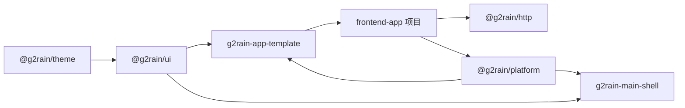

# g2rain-appkit 平台共享库登记

## 登记信息

| 项目 | 内容 |
| --- | --- |
| 仓库 | [g2rain/g2rain-appkit](https://github.com/g2rain/g2rain-appkit) |
| 平台角色 | Supporting Library，与 `g2rain-common`、`g2rain-spring-boot-starter` 相同 |
| 架构类型 | `platform-shared-library` |
| 实现类型 | `frontend-shared-packages` |
| 平台身份 | g2rain 官方前端公共契约与基础能力库 |
| 实现策略 | `organization-singleton` |
| 当前状态 | Theme、UI、HTTP 与 Platform 首版已在仓库内完成验证；当前通过 `g2rain-member-app` 进行整体验证，未发布任何 npm 包 |
| 发布形态 | npm workspaces 中独立发布的 `@g2rain/*` 包 |
| 关联 Profile | [`frontend-app 1.0.0`](../profiles/frontend-app/README.md)、[`frontend-shell 1.0.0`](../profiles/frontend-shell/README.md) |

`g2rain-appkit` 不是浏览器 App、主应用或脚手架，因此不采用 `frontend-app` 或 `frontend-shell` 的应用目录和运行时分层。它与 `g2rain-common`、Starter 一样，通过稳定、版本化的公共制品服务其他项目。

## 平台职责

仓库负责：

- `@g2rain/theme`：设计变量、亮暗主题、基础样式与 Element Plus 变量映射；
- `@g2rain/ui`：无业务耦合的 Vue 公共组件与组合式函数；
- UI 平台组件包含 OrganSelect、DictText、StatusSwitch，组织策略和字典数据通过 G2rainUi.dataProviders 注入，提交通过回调注入；EntityDataProvider 为后续 User 等实体复用。现有 App 尚未替换本地组件，StatusSwitch 成功后才更新值的迁移差异见项目侧 platform-data-components 文档；
- `@g2rain/http`：HTTP Client、序列化、通用签名、错误模型与可组合拦截器；
- `@g2rain/platform`：Main/Sub 共享协议、子应用生命周期、权限、Loading、主题、微应用消息和应用装配能力；
- Playground、类型检查、测试、构建、npm pack 和真实应用制品验证；
- 公共 API、CSS 变量、运行时消息和版本迁移文档。

仓库默认不负责：

- 业务页面、领域 API、具体 Store、路由或 Mock 数据；
- 应用环境读取、具体 Token 存储、登录跳转和领域授权决策；
- Main Shell 的全局导航、微应用编排和主题所有权；
- App CLI 的项目创建流程或 App Template 的完整工程骨架；
- 后端服务的认证、鉴权或业务数据所有权。

## 与同类 Supporting Library 的关系

| 项目 | 公共制品 | 能力层次 |
| --- | --- | --- |
| `g2rain-common` | Maven 公共 JAR | 后端公共模型、契约与无框架基础能力 |
| `g2rain-spring-boot-starter` | Maven Starter JAR | 后端平台能力的 Spring Boot 自动装配与接入 |
| `g2rain-appkit` | npm 公共包 | 前端主题、组件、HTTP 与浏览器运行时公共能力 |

三者平台角色一致，但公共 API、依赖规则、工具链和发布验证按实现类型分别治理。

## 依赖和消费关系

`@g2rain/http` 与 `@g2rain/platform` 并行，不形成包级硬依赖；由业务应用组合根按需装配。包依赖保持单向且不反向导入业务应用。Vue、Element Plus 等由宿主提供的框架依赖使用 `peerDependencies`；消费方只从 `package.json#exports` 声明的入口导入。

## 跨仓库契约

中央登记关注：

- npm 包名、`exports` 入口、类型声明和 peer dependency 范围；
- 组件 Props、事件、Slots 和可组合函数签名；
- `--g2-*` CSS 语义变量及 Element Plus 映射；
- HTTP 工厂参数、错误模型、认证刷新和重试行为；
- qiankun 消息类型、载荷、监听器释放及重复挂载行为；
- App Template、业务 App 和 Main Shell 支持的最低公共包版本。

改变上述契约时必须评估 `frontend-app`、`frontend-shell`、`g2rain-app-template` 和至少一个真实业务 App。

## 发布和验证要求

1. 发布包完成类型检查、单元测试和生产构建。
2. 使用 `npm pack` 检查制品，不能以 `npm link` 代替发布验证。
3. Playground 从公开入口消费各包并完成生产构建。
4. 主题与 UI 变更验证亮色、暗色和 Element Plus 一致性。
5. Platform 变更验证独立模式、qiankun 挂载、卸载、重新挂载，以及 Main/Sub 协作。
6. 当前以 `g2rain-member-app` 为唯一整体验证试点；验证期间仅使用 `npm pack` 制品，不发布任何 npm 包。
7. 只有 Member 整体验证通过后，才可在至少一个真实 App 使用发布候选制品完成构建，并进入正式发布流程。
8. 不兼容变更提供迁移和回滚说明，并遵循语义化版本。

## 当前核对状态

- 已依据项目 README 建立总体架构、包边界、主题协作、开发、发布、迁移和 ADR 文档；
- 已建立中央 `platform-libraries` 类型、项目目录条目和项目侧架构元数据；
- 已实现 `@g2rain/theme`、`@g2rain/ui`、`@g2rain/http` 与 `@g2rain/platform` 首版能力及 Playground；
- 已通过库内类型检查、单元测试、四包构建、Playground 生产构建、制品入口检查和 `npm pack` 制品验证；
- 当前通过 `g2rain-member-app` 验证 Theme、UI、HTTP 与 Platform 的真实组合行为，包含独立模式、qiankun 集成与 Main/Sub 协作；整体验证通过前不发布 npm 包、不进入模板/CLI 的规模化推广。
