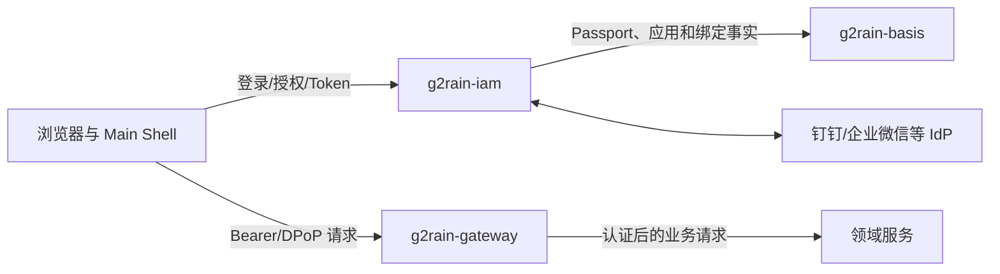

# g2rain-iam 平台服务登记

## 登记信息

| 项目 | 内容 |
| --- | --- |
| 仓库 | [g2rain/g2rain-iam](https://github.com/g2rain/g2rain-iam) |
| 架构类型 | `identity-security-service` |
| 平台身份 | g2rain 统一身份入口、授权服务与 Token 中心 |
| 实现策略 | `organization-singleton` |
| 当前状态 | Platform Singleton；源码与项目描述已核对 |
| 当前项目版本 | `1.0.0` |
| 运行形态 | Java 25、Spring Boot 4、独立可执行服务 |
| 关联 Profile | [`frontend-shell 1.0.0`](../profiles/frontend-shell/README.md)、[`frontend-app 1.0.0`](../profiles/frontend-app/README.md) |

`g2rain-iam` 不是研发工具，也不是普通领域 CRUD 服务。它持续运行并向整个平台提供认证协议、安全令牌和第三方身份接入能力，因此作为平台唯一安全服务登记，不强行采用 `java-domain-service`，当前也不为唯一实现提前创建通用 Profile。

## 平台职责

IAM 负责：

- 登录、授权确认、授权码签发、Token 签发、刷新、交换和注销流程；
- 浏览器认证会话及其过期、清理和并发安全；
- JWT/JOSE、DPoP、签名密钥选择和 Token 安全属性；
- 钉钉、企业微信等 IdP 登录、回调、状态校验和通行证绑定编排；
- 登录、注册、授权确认等认证流程页面；
- 身份安全事件、错误码、审计线索和认证链路可观测性。

IAM 默认不负责：

- Passport、用户、组织、应用和资源等主数据所有权；这些事实由 Basis 等领域服务维护；
- Gateway 的路由、统一入口和对业务请求的最终后端鉴权；
- Main Shell 的全局菜单、Tab、子应用装载和浏览器运行时治理；
- 业务服务内部的领域授权规则和数据级权限判断；
- 第三方 IdP 自身账号、组织和凭证生命周期。

## 跨仓库关系

| 协作者 | IAM 与其边界 |
| --- | --- |
| `g2rain-main-shell` | Shell 发起登录、处理回调并协调浏览器 Token；IAM 决定认证协议和 Token 语义 |
| `g2rain-gateway-*` | Gateway 校验和转发业务请求；IAM 提供可信身份与 Token 契约 |
| `g2rain-basis` / `g2rain-basis-api` | Basis 拥有 Passport、用户、应用、IdP 绑定等主数据；IAM 编排认证并通过受控 API 使用这些事实 |
| 领域服务 | 服务执行最终业务授权，不能把前端可见权限或仅解码 Token 当作完整授权 |
| 第三方 IdP | IAM 校验回调并映射外部主体；外部 access token 和 Secret 不向普通业务模块泄露 |

## 关键协议契约

中央登记至少关注以下兼容面，具体参数和示例由 IAM 仓库维护：

- `/auth/authorize`：客户端、回调地址、state、会话和授权确认；
- `/auth/token`：授权码、刷新、交换、客户端认证、DPoP 和错误响应；
- 登录、注册、验证码、登出和会话 Cookie；
- 钉钉、企业微信等 IdP 的 authorize、callback、bind 和服务商回调；
- JWT claims、issuer、audience、kid、算法、过期时间和密钥轮换；
- IAM 与 Basis 的 Passport、应用、绑定和授权码协作接口。

协议字段、错误码、Cookie 属性、Token claims、签名算法、回调地址规则或缓存语义发生变化时，必须评估 Main Shell、Gateway、Basis 和现有客户端的兼容性，不能只按 IAM 内部重构处理。

## 安全基线

1. 私钥、IdP Secret、Cookie Secret 和生产凭证只能通过安全配置注入，不进入 Git、镜像层、日志或接口响应。
2. Token 日志必须脱敏；授权码、state、nonce、验证码和刷新凭据应短期、一次性并具备重放保护。
3. `redirect_uri`、client、issuer、audience、算法和 key id 必须严格校验，不允许宽松前缀或客户端自行降级算法。
4. DPoP 需要校验签名、htu、htm、iat、jti 和重放；不能只检查 Header 存在。
5. 会话 Cookie 必须按部署条件设置 Secure、HttpOnly、SameSite、Domain、Path 和过期策略。
6. IdP 回调必须校验 state、签名、时间窗、租户/企业身份和绑定上下文，并限制回调错误信息泄露。
7. 登录、Token、验证码、绑定和回调端点需要限流、异常审计和可观测告警。
8. 密钥轮换必须支持新旧 key 的受控过渡、撤销、缓存刷新和回滚，不能依赖重新部署时偶然生效。

## 变更与验证要求

- 普通内部重构：执行 IAM 单元/集成测试和构建，确认协议响应不变。
- 认证协议或 Token 变化：联合 Main Shell、Gateway、Basis 和至少一个真实客户端验证成功与失败路径。
- 新增 IdP：验证内部/第三方应用模式、state/回调签名、账号绑定、解绑、重复回调和供应商异常。
- 密钥或会话变化：增加威胁分析、轮换/失效验证、回滚方案和审计检查。
- 发布说明必须明确兼容性、配置迁移、密钥影响和依赖服务最低版本。

## 当前核对状态

- 已确认项目为 Spring Boot 可执行服务，当前版本 `1.0.0`；
- 已确认存在授权、Token、会话、DPoP、钉钉、企业微信、Redis、Nacos 和 Basis 协作实现；
- 已依据源码、POM、运行配置和 README 完成中央身份登记；
- 本次登记未执行 Maven 构建、测试或外部 IdP 联调，因此目录状态为 `source-reviewed`，不能写成 `build-passed`；
- IAM 仓库当前未跟踪的 `docs/design/wecom-customer-service-callback-verification.md` 属于项目进行中的设计资料，本次中央登记未修改它。

## 唯一性说明

当前只有一个 IAM 实现，因此按 `platform-singleton` 治理。若未来出现第二个身份服务、可替代实现或需要在多个仓库复用同一套强制结构，再评估提取 `identity-security-service` Profile；在此之前，中央服务登记比创建空泛 Profile 更准确。
