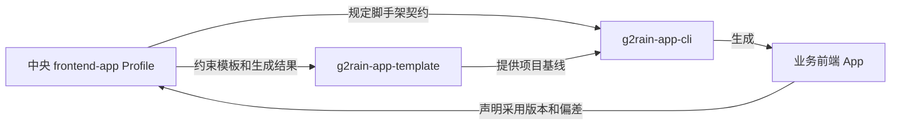

# g2rain-app-cli 平台登记

## 登记信息

| 项目 | 内容 |
| --- | --- |
| 仓库 | [g2rain/g2rain-app-cli](https://github.com/g2rain/g2rain-app-cli) |
| 架构类型 | `frontend-tooling-cli` |
| 平台身份 | g2rain 官方唯一前端项目脚手架 |
| 当前状态 | Supporting Tool，适配 `frontend-app 1.0.0`，正式兼容组合待发布 |
| 当前 CLI 版本 | `0.1.0` |
| 关联模板 | [g2rain/g2rain-app-template](https://github.com/g2rain/g2rain-app-template) |
| 关联 Profile | [`frontend-app 1.0.0`](../profiles/frontend-app/README.md) |
| 跨仓库契约 | [项目脚手架与模板契约](../profiles/frontend-app/scaffolding-policy.md) |

`g2rain-app-cli` 是平台工具，不是浏览器 App，因此自身不采用 `frontend-app` 的 components、platform、runtime、shared 和 views 分层。它的职责是创建采用该 Profile 的前端项目，并保证模板、输入参数和生成结果满足中央脚手架契约。

## 平台关系



| 对象 | 核心职责 |
| --- | --- |
| 中央 Profile | 定义所有前端 App 必须遵守的架构、运行时、安全、测试和完成标准 |
| `g2rain-app-template` | 实现可生成的前端目录、依赖、运行时、资源生成和项目文档基线 |
| `g2rain-app-cli` | 采集参数、选择模板、保护目标路径、复制、替换、验证并报告结果 |
| 生成的业务 App | 维护业务需求、页面、配置、部署信息和自身架构偏差 |

## 中央登记边界

中央仓库维护：

- CLI 是组织唯一官方前端脚手架的身份与职责边界；
- CLI、模板和 `frontend-app` Profile 的跨仓库契约；
- 三者的兼容关系、发布顺序和组织级验收要求；
- 影响所有生成项目的重大架构决策。

CLI 仓库维护：

- 安装方式、命令参数、交互式和非交互式示例；
- CLI 内部架构、路径安全、复制与替换实现；
- 单元测试、生成集成测试、npm 构建与发布；
- CLI 自身的技术债和项目级决策。

模板仓库维护模板目录、前端实现、构建部署、模板占位符和模板自身偏差。中央文档不复制这些项目实现细节。

## 版本兼容关系

CLI npm 版本、模板 Git Ref 和 Profile 版本是三个独立维度。正式发布前必须形成可追溯的兼容组合：

| CLI 版本 | 模板 Ref | Profile 版本 | 状态 |
| --- | --- | --- | --- |
| `0.1.0` | 当前尚未固定 | `1.0.0` | Profile 已正式；模板 Ref 未固定，因此仍不构成可复现的正式组合 |

正式组合不得让已发布 CLI 静默跟随模板默认分支。生成项目应记录 CLI 版本、模板来源与 Ref、Profile 版本，并生成正确的项目身份文档。

## 变更和发布顺序

```text
中央 Profile 或脚手架契约发生变化
→ 更新并验证 g2rain-app-template
→ 更新 g2rain-app-cli 的复制、替换和验证逻辑
→ 在临时目录生成完整项目并执行构建
→ 登记 CLI / Template / Profile 兼容组合
→ 发布模板 Ref 和 CLI 版本
```

只修改 CLI 命令文案或内部实现且不改变生成契约时，可以只在 CLI 仓库处理。任何会改变生成目录、依赖、Profile 声明、运行时配置或项目文档的变更，都必须检查三个仓库的一致性。

## 最低验收要求

- 交互与非交互模式产生一致、可预测的结果；
- 不覆盖已有目标目录，不允许项目名逃逸目标父目录；
- 模板来源和版本可追溯，复制过程不携带 Git 元数据、密钥、依赖缓存和构建产物；
- 所有必需占位符完成替换，生成项目不保留模板仓库身份；
- 生成项目包含正确的 `AGENTS.md`、`docs/project.yaml`、Profile 声明和偏差入口；
- 生成项目依赖安装与生产构建通过；
- CLI 包的两个命令入口、构建产物和 npm tarball 通过发布前验证。

当前实现与这些要求的差距在 CLI 仓库的 `docs/architecture/deviations.md` 中维护，不能把目标规则误写成已实现能力。

## 唯一性说明

`g2rain-app-cli` 当前是唯一官方实现，因此不为它创建独立 Profile。若未来出现多个同类脚手架，再评估提取 `frontend-project-scaffolder` Profile；在此之前，它按“平台工具”治理即可。
