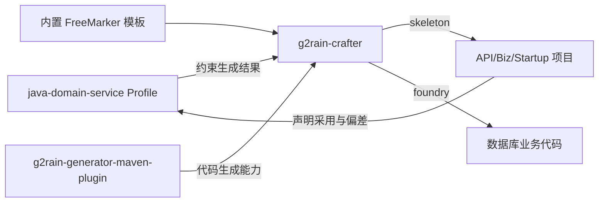

# g2rain-crafter 平台工具登记

## 登记信息

| 项目 | 内容 |
| --- | --- |
| 仓库 | [g2rain/g2rain-crafter](https://github.com/g2rain/g2rain-crafter) |
| 架构类型 | `backend-scaffolding-maven-plugin` |
| 平台身份 | g2rain 官方后端项目骨架与业务代码生成器 |
| 实现策略 | `organization-singleton` |
| 当前版本 | `1.0.7` |
| Maven Goal | `g2rain:bootstrap` |
| 上游生成器 | `com.g2rain:g2rain-generator-maven-plugin:1.0.6` |
| 关联 Profile | [`java-domain-service 1.0.0`](../profiles/java-domain-service/README.md) |

`g2rain-crafter` 是开发期 Maven 插件，不是生产服务，也不采用生成项目的运行时 Profile。它通过 skeleton 阶段生成 API/Biz/Startup 多模块骨架，通过 foundry 阶段调用底层生成器持续生成数据库业务代码。

## 平台关系

## 中央职责边界

中央仓库维护工具的唯一官方身份、生成结果与 `java-domain-service` 的关系、版本兼容和组织级验收。Crafter 仓库维护 Goal 参数、交互/非交互行为、模板、路径写入、测试、Maven Central 发布和自身技术债。底层 generator 仓库维护表元数据到代码的具体生成规则。

## 生成契约

- `phase=skeleton` 创建根 POM 和 API/Biz/Startup 三模块工程；
- `phase=foundry` 在现有项目中读取数据库与表配置并生成业务代码；
- phase 为空时按 skeleton → foundry 顺序执行；
- 显式 Maven `-D` 参数优先于 `codegen.properties`，非交互环境必须提供全部必填项；
- 数据库密码不得输出、写入模板默认值或进入发布日志；
- `tables.overwrite=false` 是默认保护，启用覆盖必须明确报告目标文件；
- 生成结果必须记录 Crafter、底层 generator、模板和目标 Profile 的可追溯版本。

## 路径和覆盖安全

项目名、包名、模板相对路径和目标目录必须规范化并限制在预期输出根内。模板复制或 foundry 生成不得通过 `..`、绝对路径、符号链接或替换后的路径片段逃逸目标目录。覆盖关闭时不能静默替换已有文件；覆盖开启时也不能修改生成范围之外的文件。

当前 `SkeletonGenerator` 使用 `Files.copy(..., REPLACE_EXISTING)` 复制普通资源，且模板路径由替换结果构造，因此项目级文档必须持续记录目标目录校验和 skeleton 覆盖行为；不能只依赖 foundry 的 `tables.overwrite` 参数推断骨架生成安全。

## 版本兼容

Crafter 版本、底层 generator 版本、内置模板和 Profile 版本是独立维度。正式发布时至少记录：

| Crafter | Generator | 目标 Profile | 状态 |
| --- | --- | --- | --- |
| `1.0.7` | `1.0.6` | `java-domain-service 1.0.0` | `mvn test` 12 个测试通过；真实数据库与生成项目构建待验证 |

Profile 或模板结构变化时，必须在临时目录生成完整项目、确认无未替换占位符、执行目标项目构建，并审核 Diff 和覆盖范围。只通过插件自身单元测试不足以证明生成结果可用。

## 最低验收要求

- 插件单元测试和 `mvn test` 通过；
- `help` 和 `bootstrap` Goal descriptor 可解析；
- skeleton、foundry、完整模式以及交互/非交互模式行为一致；
- 临时目录生成结果包含正确坐标、包路径、模块、配置和文档；
- 目标路径不能逃逸，已有项目默认不被覆盖，数据库密码不泄露；
- 生成项目采用目标 Profile、构建通过且不存在未解析占位符；
- Maven 包、sources、javadoc、POM 和发布签名在发布前验证。

## 唯一性说明

当前只有一个官方后端建项入口，因此按平台唯一工具治理。若未来出现多个可替代后端脚手架，再评估提取 `backend-project-scaffolder` Profile。

## 当前验证状态

`2026-08-27` 执行 `mvn test`，12 个测试全部通过。完整模式测试按预期断言数据库连接失败路径，因此未证明真实数据库 foundry 成功；本轮也未使用已打包插件构建一个完整生成项目。中央状态为 `test-passed`，不等于生成链路端到端通过。
